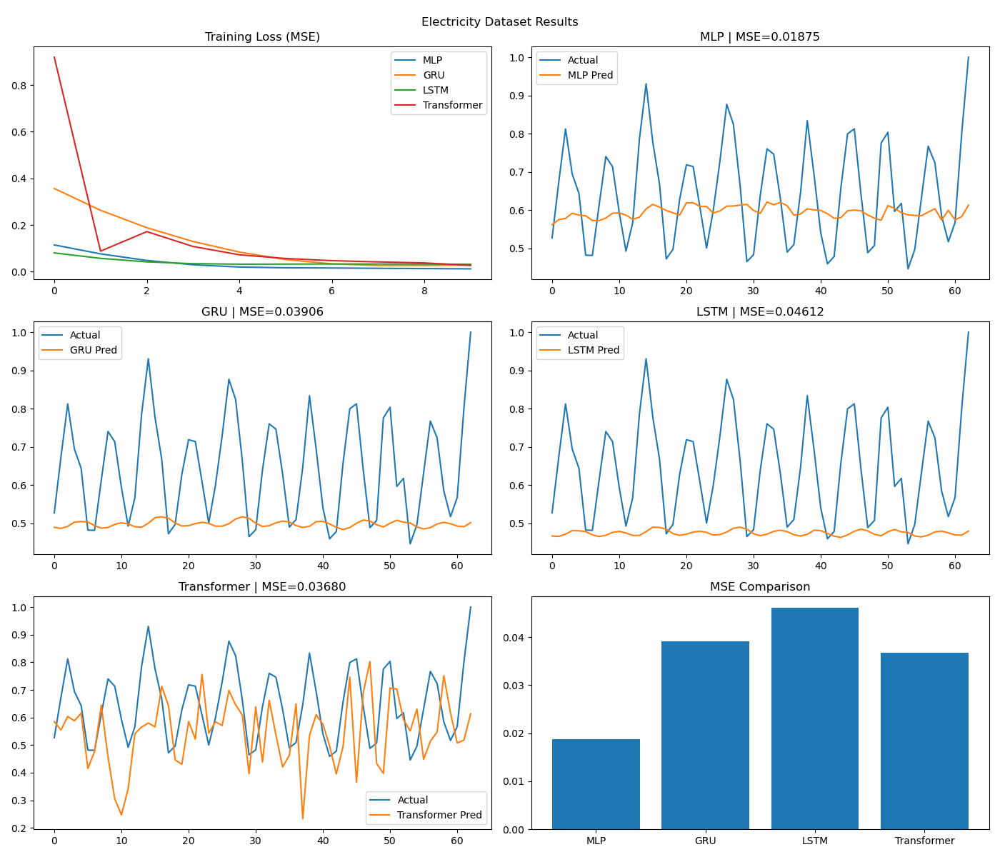
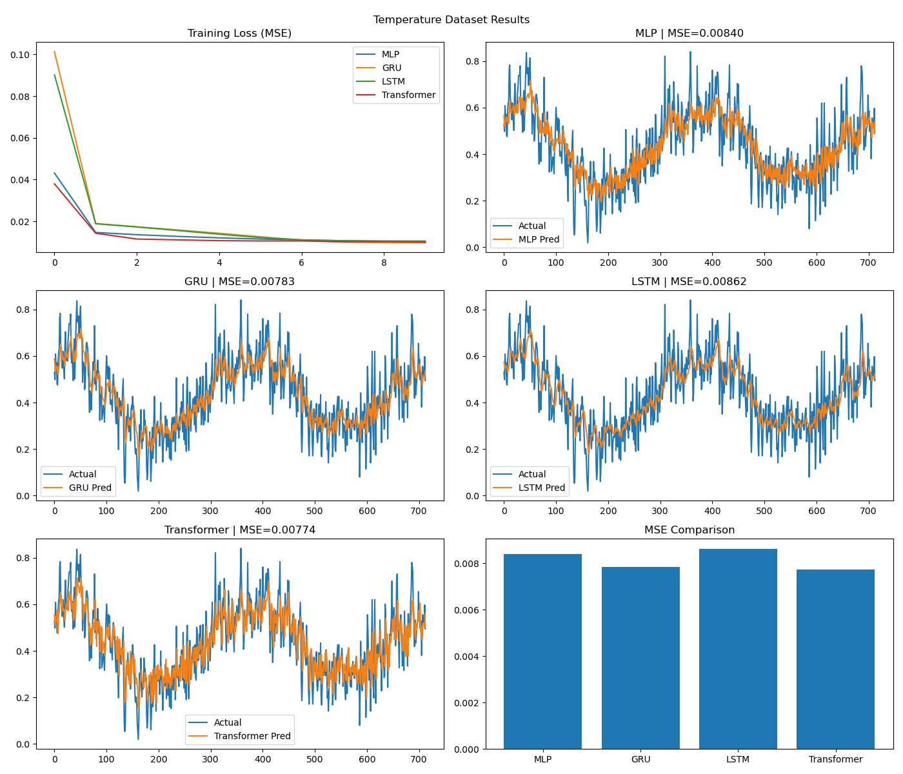

# Time-Series Forecasting Pipeline — Roll 102317087

Course Lab Assignment | TIET  
Custom GRU-based time-series forecasting implemented from scratch using PyTorch

---

## Project Overview

This project implements a complete time-series forecasting pipeline to understand:

- how sequence data is handled  
- how models learn from past values  
- where models succeed and fail  

The pipeline is evaluated on two datasets with different characteristics.

---

## Datasets Used

Electricity Production Dataset  
- Noisy and irregular  
- Contains frequent fluctuations  
- Difficult for sequence models  

Temperature Dataset  
- Smooth and seasonal  
- Predictable patterns  
- Easier to model  

---

## Models Implemented

| Model | Description |
|------|------------|
| MLP | Baseline (no sequence awareness) |
| Custom GRU | Implemented from scratch |
| LSTM | Prebuilt |
| Transformer | Prebuilt |

---

## Personalized Parameters

Roll Number: 102317087  

Digits: 1, 0, 2, 3, 1, 7, 0, 8, 7  
Sum = 29  

| Parameter | Value |
|----------|------|
| window_size | 17 |
| prediction_horizon | 1 |
| hidden_size | 14 |
| Assigned Model | Custom GRU |

---

## Methodology

Windowing converts time-series into supervised learning:

[10, 20, 30] → 40  
[20, 30, 40] → 50  

Custom GRU maintains memory using gating mechanism:

z = sigmoid(Wz [h, x])  
r = sigmoid(Wr [h, x])  
h~ = tanh(W [r*h, x])  
h = (1 - z)h + z h~  

Train-test split is chronological (no shuffling) to avoid data leakage.

---

## Results — Electricity Dataset

Observations:

- Data is noisy and irregular  
- MLP performs best (MSE ≈ 0.0187)  
- Transformer captures fluctuations but is unstable  
- GRU and LSTM struggle due to irregular patterns  
- Sequence models fail to handle sudden spikes  

---

## Results — Temperature Dataset

Observations:

- Data is smooth and seasonal  
- All models perform similarly  
- GRU and Transformer perform best (MSE ≈ 0.0077–0.0078)  
- LSTM slightly worse but stable  
- MLP performs well due to simple patterns  

---

## Model Comparison

| Model | Strength | Weakness |
|------|--------|----------|
| MLP | simple, fast | no temporal understanding |
| GRU | captures sequence patterns | sensitive to noise |
| LSTM | better memory | slower, can oversmooth |
| Transformer | global attention | unstable on noisy data |

---

## Failure Analysis

Electricity Dataset:
- Sudden spikes are unpredictable  
- High noise disrupts learning  

Temperature Dataset:
- Minor lag in peak prediction  
- Slight smoothing of sharp changes  

---

## Final Conclusion

Model performance depends on dataset characteristics.

- Electricity dataset is noisy → MLP performs best  
- Temperature dataset is smooth → all models perform well  
- Sequence models struggle with noise but perform well on patterns  
- Transformer captures global relationships but requires tuning  

---

## How to Run

pip install torch numpy pandas matplotlib scikit-learn  

---

## Dependencies

torch  
numpy  
pandas  
matplotlib  
scikit-learn  

---
